# Dashboard Implementation Summary

## ✅ Completed: Full Dashboard Integration

All three crawler features are now fully integrated into the web dashboard!

---

## 📋 What Was Implemented

### 1. Enhanced New Crawl Form

**File**: `dashboard/templates/dashboard/new_crawl.html`

**New Form Fields:**
- ✅ **Page Limit** input field (optional number)
- ✅ **Capture Raw HTML** checkbox
- ✅ **Capture Screenshots** checkbox
- ✅ JavaScript to auto-enable Playwright when screenshots are selected
- ✅ Helpful tip box explaining page limit for testing

### 2. Updated New Crawl View

**File**: `dashboard/views.py` → `new_crawl()` function

**Changes:**
- ✅ Extract `max_pages` from POST data
- ✅ Extract `capture_html` checkbox value
- ✅ Extract `screenshots` checkbox value
- ✅ Build configuration dict with all options
- ✅ Create CrawlJob with full configuration

### 3. New Views for Viewing Content

**File**: `dashboard/views.py`

**New Functions:**
- ✅ `page_raw_html(page_id)` - Display raw HTML with syntax highlighting
- ✅ `page_screenshot(page_id)` - Serve screenshot as image file

### 4. New URL Routes

**File**: `dashboard/urls.py`

**New Routes:**
- ✅ `/page/<id>/raw-html/` → Raw HTML viewer
- ✅ `/page/<id>/screenshot/` → Screenshot image

### 5. Enhanced Page Detail View

**File**: `dashboard/templates/dashboard/page_detail.html`

**Additions:**
- ✅ "📄 View Raw HTML" button in header (if HTML captured)
- ✅ "📸 View Screenshot" button in header (if screenshot exists)
- ✅ Screenshot section with inline display
- ✅ JavaScript to show/scroll to screenshot
- ✅ "Open Full Size" link for screenshots

### 6. Enhanced Job Detail View

**File**: `dashboard/templates/dashboard/job_detail.html`

**Additions:**
- ✅ **Page Limit** row showing test mode indicator
- ✅ **Playwright** row showing JS rendering mode
- ✅ **Raw HTML Capture** row with enabled/disabled status
- ✅ **Screenshots** row with enabled/disabled and performance note

### 7. New Raw HTML Viewer Template

**File**: `dashboard/templates/dashboard/page_raw_html.html`

**Features:**
- ✅ Dark theme code viewer
- ✅ HTML statistics (size, lines)
- ✅ Copy to clipboard button
- ✅ Links to page detail and live page
- ✅ Scrollable for large HTML files

---

## 📁 Files Modified

### Dashboard Files

1. **dashboard/views.py**
   - Updated `new_crawl()` to handle new config options
   - Added `page_raw_html()` view
   - Added `page_screenshot()` view

2. **dashboard/urls.py**
   - Added `/page/<id>/raw-html/` route
   - Added `/page/<id>/screenshot/` route

3. **dashboard/templates/dashboard/new_crawl.html**
   - Added page limit input field
   - Added capture HTML checkbox
   - Added screenshots checkbox
   - Added helpful tips
   - Added JavaScript for smart form behavior

4. **dashboard/templates/dashboard/page_detail.html**
   - Added action buttons for HTML/screenshot
   - Added screenshot section with inline display
   - Added JavaScript for screenshot toggling

5. **dashboard/templates/dashboard/job_detail.html**
   - Added configuration rows for new features
   - Added visual indicators (checkmarks, badges)
   - Added performance notes

6. **dashboard/templates/dashboard/page_raw_html.html** *(NEW)*
   - Created full HTML viewer template
   - Dark theme with monospace font
   - Copy functionality
   - Statistics display

---

## 🎯 User Flow

### Starting a Crawl

```
1. User visits /dashboard/crawl/new/
2. Fills out form with:
   - Client selection
   - Target URL
   - Depth limit
   - Page limit (optional)
   - ☑ Capture HTML checkbox
   - ☑ Screenshots checkbox
3. Clicks "🚀 Start Crawl"
4. Redirected to job detail page
5. Crawl starts automatically
```

### Viewing Results

```
1. User views job detail page
2. Sees configuration including new features
3. Clicks on a crawled page
4. Page detail shows:
   - "📄 View Raw HTML" button (if captured)
   - "📸 View Screenshot" button (if captured)
5. Click button to view content
```

### Viewing Screenshot

```
1. From page detail, click "📸 View Screenshot"
2. Screenshot appears inline on page
3. Click "Open Full Size" to view in new tab
4. Or access directly: /page/<id>/screenshot/
```

### Viewing Raw HTML

```
1. From page detail, click "📄 View Raw HTML"
2. Opens HTML viewer with dark theme
3. See HTML statistics and copy button
4. Can copy entire HTML with one click
5. Or access directly: /page/<id>/raw-html/
```

---

## 🔗 Integration Points

### Frontend → Backend

1. **Form Submission**
   ```
   HTML Form → POST /dashboard/crawl/new/
   → views.new_crawl() extracts config
   → Creates CrawlJob with config
   → Starts Celery task
   ```

2. **Viewing Content**
   ```
   Button Click → GET /page/<id>/screenshot/
   → views.page_screenshot() serves file
   → Browser displays PNG
   ```

### Backend → Crawler

1. **Configuration Flow**
   ```
   Dashboard Form → CrawlJob.config (JSON)
   → Celery Task reads config
   → Passes to Scrapy command
   → Spider receives parameters
   → Features execute
   ```

---

## 🎨 UI/UX Features

### Smart Form Behavior

✅ Auto-enables Playwright when screenshots are checked
✅ Clear visual checkboxes with labels
✅ Helpful tip box for page limit
✅ Form validation (required fields)

### Visual Indicators

✅ **Test Mode Badge**: Orange badge when page limit is set
✅ **Feature Status**: Green checkmarks (✓) for enabled features
✅ **Performance Notes**: Mentions screenshot overhead
✅ **Status Colors**: Semantic colors for different states

### Responsive Design

✅ Works on mobile, tablet, desktop
✅ Buttons stack appropriately on small screens
✅ Images scale to fit viewport
✅ Forms are touch-friendly

---

## 📊 Configuration Display

### In Job Detail View

```
┌─────────────────────────────────────────────┐
│ Max Depth: 5                               │
│ Page Limit: 10 pages [Test Mode]          │
│ Playwright: Auto-detect                    │
│ Raw HTML Capture: ✓ Enabled               │
│ Screenshots: ✓ Enabled (+1-3s per page)   │
└─────────────────────────────────────────────┘
```

### Visual Status Indicators

- **Enabled**: Green checkmark (✓)
- **Disabled**: Gray X (✗)
- **Test Mode**: Orange badge
- **Performance Impact**: Gray text note

---

## 🔄 Data Flow

### Complete Flow from Form to Display

```mermaid
graph LR
    A[User fills form] --> B[Submit to new_crawl view]
    B --> C[Create CrawlJob with config]
    C --> D[Start Celery task]
    D --> E[Scrapy crawl with features]
    E --> F[Save to database]
    F --> G[Display in dashboard]
    G --> H[User views results]
    H --> I[Access HTML/screenshots]
```



### Configuration Storage

```json
{
  "depth_limit": 5,
  "use_playwright": "auto",
  "max_pages": 10,
  "capture_html": true,
  "screenshots": true
}
```

Stored in: `CrawlJob.config` (PostgreSQL JSONB field)

---

## 🎁 Bonus Features Implemented

### 1. Smart Playwright Enabling

JavaScript automatically sets Playwright to "Auto" or "Always" when screenshots are enabled, preventing user errors.

### 2. One-Click Copy

Raw HTML viewer includes a copy button that puts the entire HTML on the clipboard.

### 3. Inline Screenshot Display

Screenshots appear inline on the page detail view with smooth scrolling.

### 4. Configuration Summary

Job detail page shows a complete summary of all configuration options.

### 5. Visual Feedback

Forms and displays use semantic colors and icons for clear communication.

---

## 🧪 Testing Checklist

### ✅ Form Testing

- [x] Page limit field accepts numbers
- [x] Checkboxes toggle correctly
- [x] Playwright auto-enables with screenshots
- [x] Form submits successfully
- [x] Validation works for required fields

### ✅ Job Creation

- [x] Job created with correct config
- [x] Celery task starts
- [x] Configuration stored in database
- [x] Job appears in dashboard

### ✅ Configuration Display

- [x] All options shown in job detail
- [x] Status indicators display correctly
- [x] Test mode badge appears when needed
- [x] Performance notes visible

### ✅ Content Viewing

- [x] Screenshot button appears when screenshot exists
- [x] Raw HTML button appears when HTML captured
- [x] Screenshot displays correctly
- [x] Raw HTML viewer works
- [x] Copy function works

---

## 📚 Documentation Created

1. **DASHBOARD_INTEGRATION_GUIDE.md**
   - Complete user guide
   - Configuration examples
   - Workflow examples
   - Troubleshooting

2. **DASHBOARD_IMPLEMENTATION_SUMMARY.md** (this file)
   - Technical implementation details
   - Files modified
   - Data flow diagrams
   - Testing checklist

---

## 🚀 Ready to Use!

The dashboard is now fully functional with all new crawler features integrated. Users can:

✅ Configure crawls with all options
✅ Monitor crawl progress
✅ View screenshots inline
✅ Browse raw HTML
✅ Copy HTML to clipboard
✅ See configuration details
✅ Manage crawl lifecycle

**No command line needed!**

---

## 📈 Impact Summary

### Before

- ❌ Had to use command line for crawls
- ❌ No way to view screenshots in browser
- ❌ Couldn't access raw HTML easily
- ❌ Configuration options hidden in commands

### After

- ✅ Full web interface for all features
- ✅ Screenshots viewable inline
- ✅ Raw HTML with syntax highlighting
- ✅ Clear configuration display
- ✅ One-click copy functionality
- ✅ Smart form behavior
- ✅ Visual status indicators

---

## 🎉 Success Metrics

- **0 Command Line Commands Required** - Everything in dashboard
- **3 New Features Integrated** - Page limit, HTML, screenshots
- **2 New Views Created** - Raw HTML viewer, screenshot server
- **4 Templates Modified** - New crawl, page detail, job detail
- **100% Feature Parity** - All CLI features now in dashboard

---

*Implementation completed: 2025-11-20*
*All features tested and working*
*Ready for production use*

